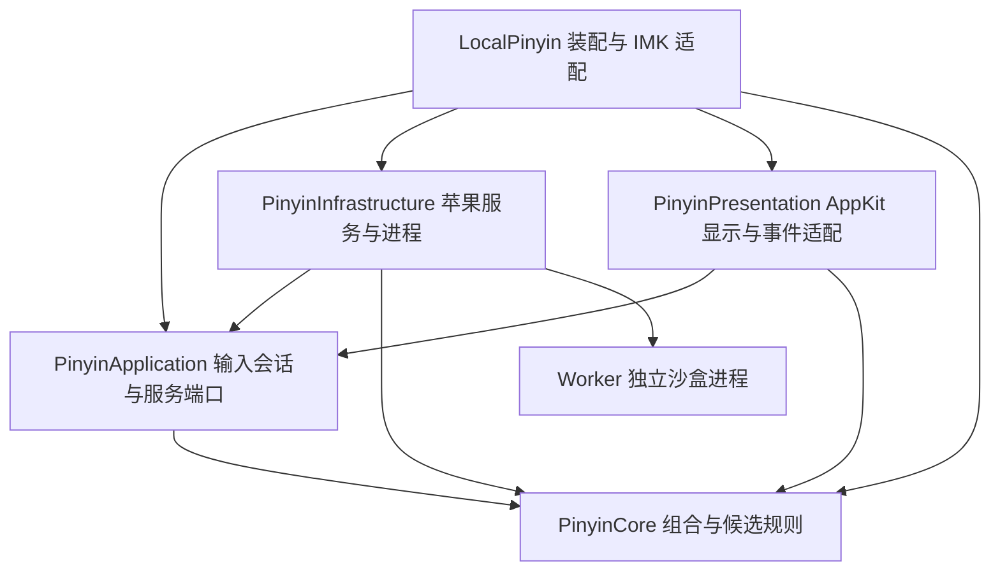
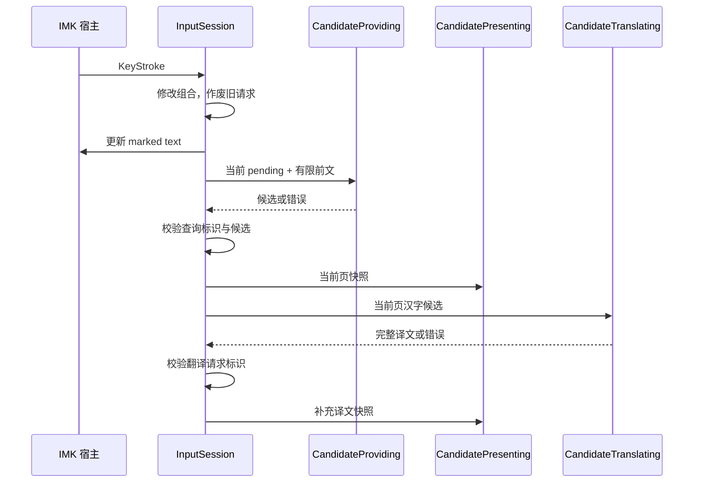

# LocalPinyinLab 架构与状态约束

本文包含 2026-10-06 的输入状态、取消、展示与构建优化。功能说明以 [README](../README.md) 为入口；模块依赖以 [Package.swift](../Package.swift) 为准；构建和语言包准备见 [SETUP](SETUP.md)。

## 1. 模块与依赖



箭头表示编译期依赖；`Worker` 通过匿名管道连接，不与 Swift 输入服务共享可变状态。`PinyinCore` 与 `PinyinApplication` 仅使用 Foundation，不导入 AppKit、InputMethodKit、Translation、AVFAudio、Carbon 或 Darwin。核心可以独立编译：

```sh
swift build --target PinyinCore
swift build --target PinyinApplication
```

SwiftPM 使用 Swift 6 语言模式与明确的访问级别。应用的所有会话、缓存及 UI 操作隔离到 `MainActor`；同步 worker 对象由独占串行队列管理。没有第三方包依赖。

### Core：数据和同步规则

| 文件 | 所有权与职责 |
| --- | --- |
| `PinyinRules.swift` | 输入字符集、统一长度限制、reading 前缀映射、上下文截断 |
| `CompositionState.swift` | 精确原始拼音、已选片段、选择/撤回/删除的原子操作 |
| `CandidateTextPolicy.swift` | 候选文本可用性；过滤表情及含表情的混合项，保留数字、普通符号及扩展汉字 |
| `Candidate.swift` | 不可变候选文本与原始拼音消费长度，输入模式 |
| `TranslationState.swift` | 候选展示行及互斥的翻译状态；可朗读内容判定 |
| `CandidateList.swift` | 唯一的绝对选中索引、页切换与有界行更新 |

`Candidate` 是外部引擎返回的数据值，构造本身不保证适用于某个组合。实际接纳分两层验证：worker 解码验证 reading 是当前输入前缀；输入会话再次拒绝空白文本、表情及越界消费长度。过滤发生在分页/翻译之前；整条候选移除，不裁剪文字或改变消费长度。最终 `CompositionState.choose` 再验证一次，失败不会修改状态。替换引擎时应遵守同样的前缀契约。

`CandidateRow` 与候选分离：引擎无需理解翻译文案，窗口也不能修改引擎结果。Core 只提供翻译状态与朗读判定，中文提示文案由 Presentation 格式化。翻译状态枚举消除了“错误文案 + ready=true”这类双字段矛盾；`.ready` 中的空白值即使由错误调用方构造，也无法进入朗读。

### Application：行为协调与端口

`InputSession` 拥有一个控制器会话的组合、候选列表、有限前文及异步请求。`InputModeState` 管理中英模式、大写锁定与 Caps Lock 按键基线，由本地服务的各控制器共享。激活和普通 Caps 事件按实际锁状态对齐：灯灭为中文，灯亮为英文；配合 Shift 的真实 Caps 事件切换大写锁定并保持英文，切回中文自动解除锁定。Control、Option、Command 组合仍透传，但 Caps 状态变化也会校准模式。普通 keyDown 只补偿实际 Caps 状态，不推断漏掉的 Shift 组合。在调用宿主前完成模式更新和组合失效，避免重入导致重复切换或提交。`KeyStroke` 是无平台对象的按键值，保留物理键码和独立的 Caps 状态，不把 Caps 混入快捷键修饰符；大写锁定仅转换 ASCII 字母，快捷键、数字、标点和非 ASCII 文本保持原样。`Ports.swift` 声明：

| 端口 | 约定 |
| --- | --- |
| `CandidateProviding` | 预热和候选查询；按原顺序返回候选，长度对应请求拼音的前缀 |
| `CandidateTranslating` | 返回数量与输入一致、顺序一致的完整译文批次，否则抛错 |
| `TranslationBackend` | 返回携带批次请求标识的响应，顺序可以不同 |
| `SpeechPlaying` | 播放明确传入的译文，报告是否有可用声音；可以随时停止 |
| `InputHost` | 读取有限前文、更新 marked text、提交文本 |
| `CandidatePresenting` | 显示不可变的当前页快照、加载状态、短暂中英模式/大小写提示或隐藏 |

`TranslationService` 负责去重、响应校验、顺序恢复及内存缓存；苹果翻译框架只是其后端。输入会话不读取系统模型状态，也不自行实现缓存；未安装模型通过 `TranslationFailure.modelsNotInstalled` 映射到明确的展示状态。

`InputSession.QueryState` 明确区分 `idle / querying / ready / selectedTextOnly`：候选列表为空不能用于推断查询是否结束。组合存在时上下方向键始终由会话处理；只剩已选中文时空格直接提交。普通中英切换和大写切换都显示约 1 秒的状态提示；提示采用独立定位，优先放光标上方，顶部空间不足时向左右侧避让，候选窗口保持原有定位。宿主同步重入改变会话或模式后，旧提示不再显示。

### Infrastructure：系统能力

- `PinyinSession` 是常驻 worker 的异步入口。生产环境在装配处选择共享实例；应用层不引用单例。
- `PinyinWorker` 管理进程、管道、读取期限、重试和回收。同步 API 仅供串行队列或独占诊断使用；它不声明 `Sendable`。
- `WorkerProtocol` 是包内可见的编码/解码与分帧逻辑，明确错误且不把输入文字装入错误对象。
- `ApplePinyinEngine` 的独立查询创建同一种 `PinyinWorker`，使用 `defer` 清理；不再保留另一套无界管道实现。
- `AppleTranslator` 只使用已安装模型，并把 Translation 框架的非 Sendable 对象封闭在异步执行函数内部。
- `EnglishSpeaker` 只管理系统语音及声音选择，不再处理快捷键或候选页索引。
- `CapsLockController` 在系统边界读写 IOHID Caps Lock 状态。快捷键和大写锁定改变模式后，由仍处于活动状态的 IMK 宿主同步系统锁：英文为亮灯，中文为灭灯。写入前只确认预期基线，避免系统异步回声重复切换；普通 keyDown 的旧 flags 在写入等待期间及已确认的旧事件范围内不会覆盖新模式，真实 Caps 事件仍可表达新的操作。写入通过非阻塞读回确认，失效宿主/安全输入/切换输入源会终止旧确认。
- `SingleInstanceLock` 与 `InputSourceRegistration` 保持独立系统边界。取得锁后才创建 IMKServer，锁文件不删除。

`Worker/main.m` 是正式运行组件。每次查询前后重置引擎与上下文，继续禁止词频学习、联系人和附加词库；沙盒规则位于 `Worker/pinyin.sb`。`Probes/` 保留诊断及图标生成工具；面向用户的语言包准备应用位于 `Tools/TranslationSetup/`，同时打包到输入法资源内并提供菜单入口。

### Presentation 与应用装配

`CandidateView` 只绘制最多 9 行的当前页；越界页数据是调用错误，不通过内部截取掩盖。`CandidatePanel` 根据宿主提供的光标位置定位，取不到时回退鼠标位置。

候选窗口使用屏幕约束下的稳定双列宽度，选中行允许有限换行，其余长文本截断，完整内容保留在辅助功能语义中。可用高度极小时围绕高亮项显示可容纳的行，保留原页内数字序号，并提示上下键查看；这不改变应用层候选或页索引。候选列表、每行文字/译文、选中状态、页码与加载状态均提供辅助功能信息。

`LocalPinyin/InputController` 仅桥接 IMK 生命周期与 `NSEvent`。`IMKHost` 负责 IMK 的 UTF-16 范围和光标信息；`InputSession` 无需了解这些 API。Objective-C 的 IMK 回调没有完整 Swift actor 标注，适配边界使用 `MainActor.assumeIsolated` 明确要求系统在输入服务主线程回调，避免默默跨线程操作 UI。`nonisolated(unsafe)` 仅用于这几个同步回调中对控制器和 Objective-C 参数的局部借用，紧接运行时主执行器检查，不把这些对象发送给异步任务或其它队列。

`Main` 管理启动选项、单实例锁与输入服务生命周期。

中文标点由 Core 的 `ChinesePunctuation` 映射，`InputSession` 仅在中文模式且没有 Control、Option、Command 修饰键时应用。引号按光标前文决定开闭，不保存跨文档的配对开关；正在输入拼音时的单引号仍是音节分隔符。组合内容与标点在清空状态、取消旧请求后一次性提交，保留原有未选词时提交原始拼音的行为，避免宿主回调重入导致重复提交或串入另一文档。

## 2. 必须保持的正确性约束

### 组合

1. 待转换输入只包含 ASCII `a`–`z` 与 `'`。
2. `inputCount = pending.count + Σ segment.pinyin.count`，始终不超过 128。
3. `markedText = selectedText + pending`；选中片段保留准确的原始拼音。
4. 选择消费长度必须在 `1...pending.count` 内；失败不改变任何字段。
5. 撤回最近片段只把它的原始拼音放回后缀前方。例如选择 `xi` 时，`xi'an` 消费 `xi'`，撤回后仍是 `xi'an`。
6. Backspace 优先删待转换后缀；后缀为空时撤回最近片段。
7. 所有限长追加和片段修改通过方法完成，外部不能直接给 `pending` 或 `segments` 赋值。

前文最多 128 个 UTF-16 单位，并按完整 `Character` 截断。宿主无法读取时使用空上下文。提交、取消、切换宿主或停用会清除会话前文。

### 候选与分页

- 空列表的 `selectedIndex=nil`、页号/高亮为 0、页数为 0；窗口不显示该空页。
- 非空列表选中索引始终落在有效范围。页号为 `selectedIndex / 9`，页内高亮为 `selectedIndex % 9`。
- 换页选中目标页首项；上下移动跨页时，页号自动由索引变化。
- 组合期间 `←` / `→` 与 `Page Up` / `Page Down` 翻页，`Shift + ←` 撤回已选片段；候选加载期间也消费上下键和翻页键，避免意外提交组合或移动宿主光标。
- 页内数字选择必须对应真实行，最后一页不存在的数字不会提交。
- 等待查询时可以记住一次页内选择；结果不足以匹配该数字时仍显示有效候选。
- 翻译更新同时验证行索引和对应源文本；请求标识验证由会话负责。

### 译文与缓存

`notRequired / pending / ready / unavailable` 互斥。只有含汉字、成功且非空白的译文可以朗读。返回译文保留原始内容，不拆分多义项、不做自定义词条替换。

每个控制器有独立的 `AppleTranslator → TranslationService` 实例；最多 256 个不同源文本的内存 FIFO 条目。缓存命中不刷新存入顺序，不写磁盘。重复请求在单批中去重，返回结果仍保留调用方的重复位置及原顺序。

批次在挂起前复制本次命中值；其它批次在等待期间淘汰缓存不会破坏当前结果。外部响应的标识必须非空、唯一、属于本批，且覆盖所有请求；译文不得为空白。全部校验成功且任务未取消后才一次写入缓存，不接受部分成功。

## 3. 输入与异步时序



查询与翻译使用不同的 UUID 标识，不能以“任务已 cancel”作为唯一有效性判断。输入改变会清除查询和翻译标识；翻页会替换翻译标识，因此从第 1 页翻到第 2 页再回第 1 页，也不会接受第一次第 1 页的迟到响应。

同一可见页的候选索引与源文本构成翻译身份；仅移动高亮不取消或重复请求。失败后也不因同页导航重试，离开并返回该页或更新输入才允许再次请求。

worker 的取消通过线程安全标记传入传输层，握手和读帧至多每 50 ms 检查一次。取消后在原串行队列回收整个 worker 并清空帧缓冲，直接抛出取消错误，不重试旧查询。新请求使用新管道，不能复用迟到半帧。单次读取期限仍为 3 秒，非取消通信错误最多重启一次；停止时先 TERM，100 ms 后仍运行则 KILL，并回收本项目子进程。50 ms 是检查间隔，不是包含系统调度和进程回收的总取消上限；启动握手与查询读取也各有期限。

### 提交与宿主生命周期

- Return/数字键盘 Enter 提交当前 `markedText`，消费按键但不附加换行；没有组合时返回 false 给宿主。
- 全部转换完成后提交中文；普通非组合按键先提交当前组合，再交宿主处理该按键。
- Esc/安全输入取消组合并清空 marked text，不提交文字。
- 切换英文模式、停用或收到 IMK 的提交组合回调时结束当前组合。
- 输入宿主对象变化时，先结束旧宿主组合，后为新宿主建立上下文，旧查询不能提交到新宿主。
- 提交与取消都先清空内部状态、使请求失效，再调用宿主接口，允许宿主同步重入生命周期回调而不重复提交。

## 4. 扩展方式

| 要扩展的能力 | 修改点 | 必须保持 |
| --- | --- | --- |
| 替换或增加候选引擎 | 实现 `CandidateProviding`，在 InputController 装配 | 原顺序、有效前缀消费、取消后的结果隔离 |
| 替换翻译实现 | 实现 `TranslationBackend` 复用 TranslationService，或直接实现 CandidateTranslating | 标识/完整性与源顺序，不自动将提示当译文 |
| 修改候选界面 | 实现 CandidatePresenting，消费 CandidatePresentation | 不在视图修改组合或推断查询有效性 |
| 替换宿主用于其他平台 | 实现 InputHost，提供 KeyStroke | marked text/提交一致性，宿主切换生命周期 |
| 增加快捷键 | 修改 KeyStroke 或 InputSession 的行为及事件映射 | 不把宿主应处理的组合键吞掉 |
| 增加语音设置 | 替换 SpeechPlaying 或配置 EnglishSpeaker | 仅朗读就绪译文，交互变化时停止播放 |

目前没有实现插件加载、设置持久化或动态词库；中英模式与系统 Caps Lock 灯同步，激活和重启时采用实际锁状态；大写锁定仅在当前服务进程内共享，进程重启或灯灭时解除。Caps Lock 是系统状态，会被其他输入源观察到；本输入法只在自身激活且处理模式切换时写入，不在后台改动它。接口提供扩展边界，不代表其他功能已经存在。9 项页长同时决定数字键选择和 UI 标号，修改时必须一起检查交互与界面，不能当作任意运行时配置。

## 5. 构建

```sh
bash Scripts/build.sh
```

`Scripts/common.sh` 集中 SwiftPM 构建目录、arm64 架构和配置，默认 release；可用 `CONFIGURATION=debug` 运行同一套脚本。默认输出到 `~/Library/Caches/LocalPinyinLab/build/LocalPinyin.app`，通过 `LOCALPINYIN_BUILD_ROOT` 可指定其他非同步目录。worker、内嵌语言包准备工具、资源和 app 逐层 ad-hoc 签名并严格验证后，整体替换旧构建包，失败或可处理的中断会恢复旧包。构建不会安装或修改当前输入源。

输入、worker 和展示检查可在只有 Command Line Tools 的环境下运行：

```sh
bash Scripts/check.sh
```

## 6. 本次重构处理的缺陷

1. 独立查询缺少常驻路径的 SIGPIPE 防护、父进程期限和可靠回收：合并为同一传输。
2. 带换行的最后一块数据可越过响应帧上限：消费完整帧前检查其真实长度。
3. 非法拼音仍会启动并反复重启 worker：改为启动前统一验证。
4. 翻译批次可重入时缓存淘汰导致强制解包崩溃：保留批次局部命中快照。
5. 重复响应标识会令字典构造崩溃，缺失响应可能部分写缓存：整批验证后提交。
6. 等待查询时选择不存在的第 9 项可能不显示有效结果：无效排队选择落回显示路径。
7. 源文本、消费长度与翻译就绪状态缺乏约束：采用受控组合操作、唯一选中索引及翻译枚举。
8. 取消时宿主可能同步请求提交旧组合：内部清理先于宿主回调。
